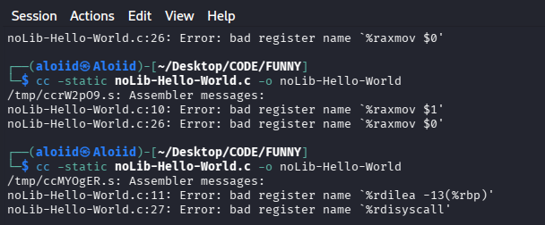
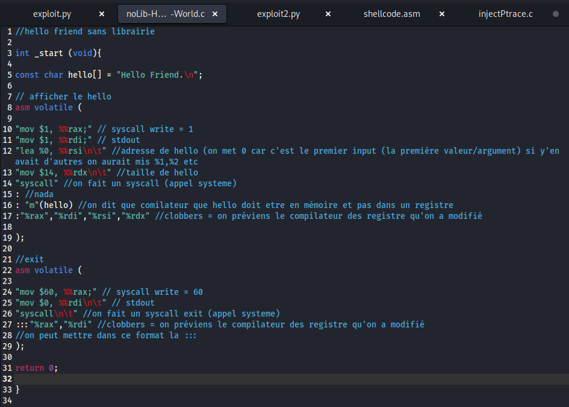

# Hello world

**Date :** vendredi 4 septembre 2026

---

Pour retirer toutes les dépendances on peut faire

**cc -static <programme.c> -o <programme>**

Ensuite on peut vérifier les dépendances présentes :

**ldd <programme>**

**Bref pour coder sans librairie soit on récris une fonction directement soit on utiliser l'assembleur pour faire des syscalls.**

**Typiquement avec hello world on pourrait coder de cette manière :**

**En** syntaxe GCC inline

```c
int _start(void) { //start représente l'entry point. 

const char hello[] = "Hello Friend.\n"; 

asm volatile (
"mov $1, %%rax;"//on call le syscall write (=1)
"mov $1, %%rdi\n\ t"// stdout avec fd = 1
"lea %0, %%rsi;" // buffer (adresse du message hello)
"mov $4, %%rdx\n\t" //la taille
"syscall"
: //ici contient les outputs qu'on veut récupérer
: "m"(hello) // ici définie l'adresse mémoire de notre string hello (peut être comme .data)
: "%rax", "%rdi","%rsi","%rdx" // on appelle ça clobbers : ici on met les registres qui vont être modifier par le programme pour éviter que le compilateur ne mette d'autres valeurs dedans
);

return 0; 
}
```

//pour eviter une concaténation je peux soit mettre ; soit \n\t.
Sinon j'aurai cette erreur :



---

Si on compile ça on va bien avoir notre message mais on risque d'avoir un segmentation fault parce que il n'y a pas de vrai fin à notre programme.

Donc on peut ajouter un syscall pour quitter notre programme convenablement :

```c
//exit
asm volatile (

"mov $60, %%rax\n\t" // syscall write = 60
"mov $0, %%rdi;" // stdout 
"syscall\n\t" //on fait un syscall exit (appel systeme)
:::"%rax","%rdi" //clobbers = on préviens le compilateur des registre qu'on a modifié 
//on peut mettre dans ce format la :::
); 
```

---

Voici le code en entier :

```c
//hello friend sans librairie 

int _start (void){

const char hello[] = "Hello Friend.\n"; 

// afficher le hello
asm volatile (

"mov $1, %%rax;" // syscall write = 1
"mov $1, %%rdi;" // stdout 
"lea %0, %%rsi\n\t" //adresse de hello (on met 0 car c'est le premier input (la première valeur/argument) si y'en avait d'autres on aurait mis %1,%2 etc
"mov $14, %%rdx\n\t" //taille de hello
"syscall" //on fait un syscall (appel systeme)
: //nada
: "m"(hello) //on dit que comilateur que hello doit etre en mémoire et pas dans un registre 
:"%rax","%rdi","%rsi","%rdx" //clobbers = on préviens le compilateur des registre qu'on a modifié 
); 

//exit
asm volatile (

"mov $60, %%rax;" // syscall write = 60
"mov $0, %%rdi\n\t" // stdout 
"syscall\n\t" //on fait un syscall exit (appel systeme)
:::"%rax","%rdi" //clobbers = on préviens le compilateur des registre qu'on a modifié 
//on peut mettre dans ce format la :::
); 

return 0;
}
```

Résultat :


